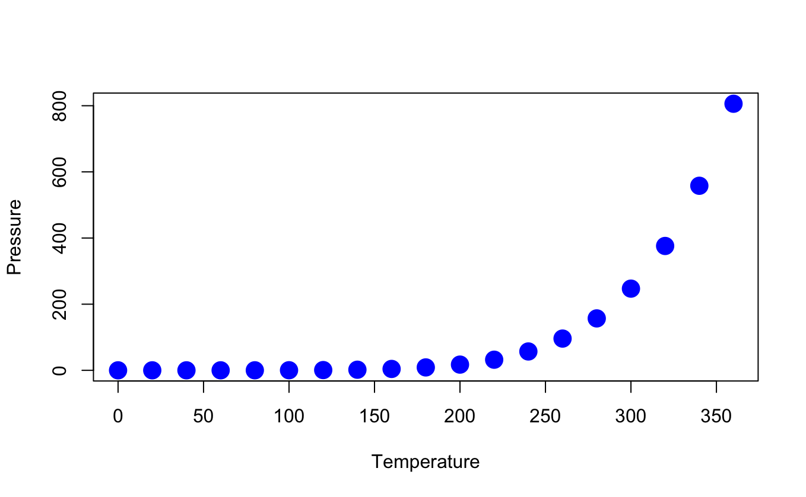

```{r setup, include=FALSE}
knitr::opts_chunk$set(echo = TRUE)
```

## Comments

<!--comments-->

*This is a demo manuscript. The tables are graphs are non-relevant to the project itself and are for practice only.*

## Tables

```{r, include = TRUE, echo = TRUE}
summary(cars)
```
**Table 1.** Speeds and distances.

```{r}
knitr::kable(head(iris))
```
**Table 2.** Iris information.


```{r}
knitr::kable(head(iris),
             align = "l",
             caption = "Iris Information")
```
**Table 3.** Iris information with caption and cell alignment settings.


## Plots

```{r pressure, echo=TRUE}
plot(pressure,
     pch = 19,
     col = "blue",
     cex = 2,
     xlab = "Temperature",
     ylab = "Pressure")
```
**Fig 1.** Pressure vs. temperature plot.

## Plots from file


**Fig 1.** Pressure vs. temperature plot imported from folder **03_figs**.


## Equations

I can have in-line equation $alpha=beta$ Or start at a new line $$alpha=beta$$

## References

This is a citation in brackets [@vanvliet2013]

@vanvliet2013 is a citation in a sentence.

## I want my references here:

::: {#refs}
:::

## General

## The `grateful` package

```{r, echo=TRUE}
grateful::cite_packages(output = "paragraph", out.dir = ".")

```

## R Markdown

This is an R Markdown document. Markdown is a simple formatting syntax for authoring HTML, PDF, and MS Word documents. For more details on using R Markdown see <http://rmarkdown.rstudio.com>.

When you click the **Knit** button a document will be generated that includes both content as well as the output of any embedded R code chunks within the document. You can embed an R code chunk like this:


Note that the `echo = FALSE` parameter was added to the code chunk to prevent printing of the R code that generated the plot.
